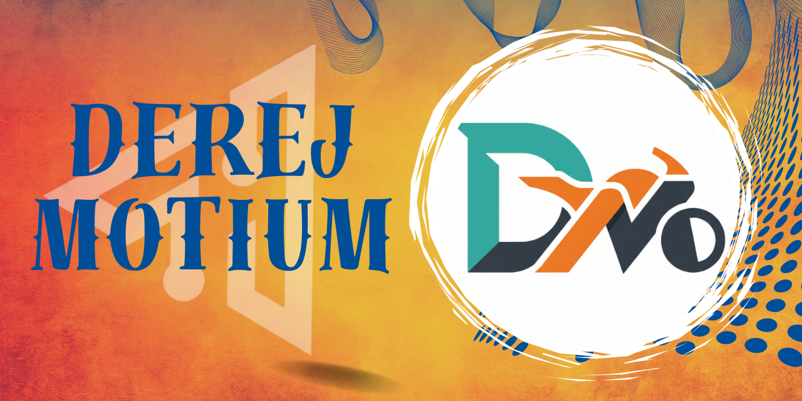
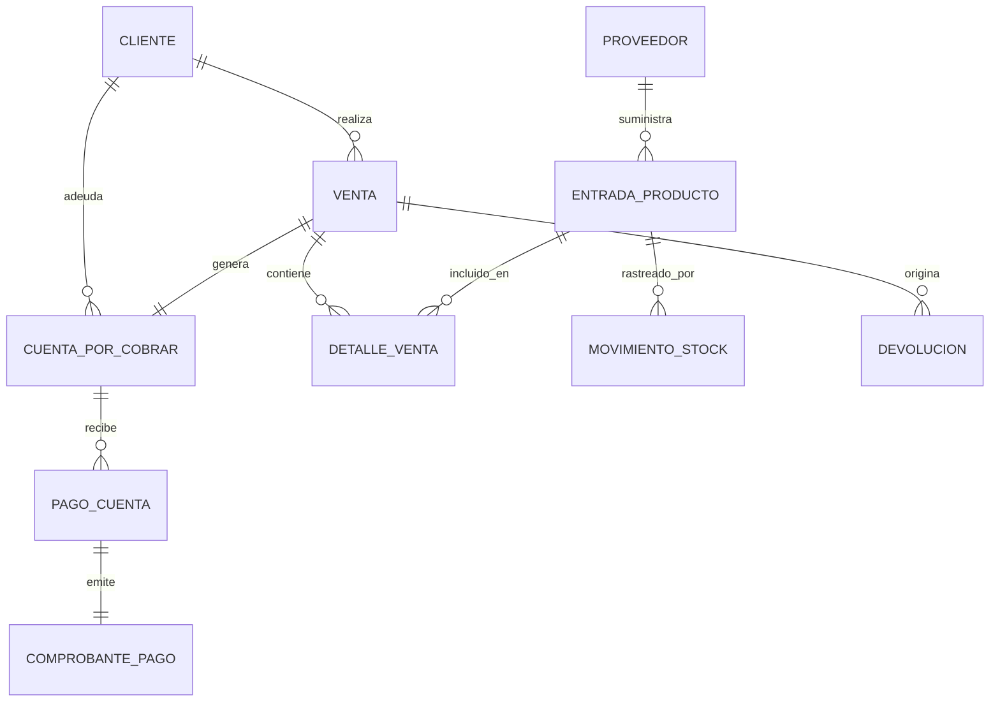
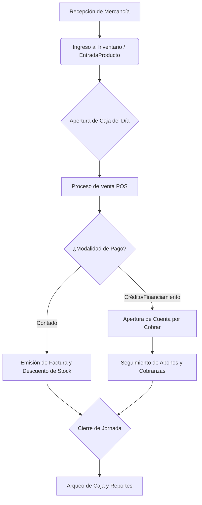

<div align="center">
  

  # 🏍️📱 DerejMotiun: Sistema de Facturación y Gestión Integral

  **Plataforma profesional para la operación comercial de motocicletas y dispositivos móviles.**

  
  
  
  
  
</div>

<hr/>

## 📖 Índice
- [1. Visión General](#1-visión-general)
- [2. Características Principales](#2-características-principales)
- [3. Tecnologías y Dependencias](#3-tecnologías-y-dependencias)
- [4. Arquitectura de la Base de Datos](#4-arquitectura-de-la-base-de-datos)
- [5. Flujo Operativo](#5-flujo-operativo)
- [6. Estructura del Proyecto](#6-estructura-del-proyecto)
- [7. Guía de Instalación y Despliegue](#7-guía-de-instalación-y-despliegue)
- [8. Seguridad y Permisos](#8-seguridad-y-permisos)
- [9. Próximos Pasos (Roadmap)](#9-próximos-pasos-roadmap)

---

## 🚀 1. Visión General

**DerejMotiun** es una plataforma centralizada y profesional diseñada para optimizar y controlar la operación diaria de casas comerciales especializadas en motocicletas y dispositivos móviles. Gestiona eficientemente el ciclo completo de ventas (contado, crédito y financiamiento), manteniendo un control riguroso del inventario, flujos de caja y gestión de cobranzas.

---

## ✨ 2. Características Principales

*   **📦 Gestión de Inventario Granular:** Control preciso por IMEI, marca, color y estado. Cálculo automático de ITBIS, costos y márgenes de ganancia garantizando rentabilidad.
*   **🛒 Ciclo de Ventas y Facturación:** Soporte integral para ventas al contado, a crédito y financiamientos con cálculo de tasas, plazos y cuotas.
*   **💰 Control de Créditos y Cobranzas:** Seguimiento de estados de crédito (Cuentas por Cobrar), cálculo de saldos en tiempo real, registro de abonos y rebajas de deuda.
*   **🏦 Gestión de Caja Centralizada:** Control estricto de apertura y cierre por usuario, con arqueos diarios y detección de discrepancias monetarias.
*   **🔄 Auditoría y Devoluciones:** Trazabilidad completa mediante bitácoras de `MovimientoStock`, soportando devoluciones que restauran el inventario dinámicamente.
*   **📊 Dashboard Analítico Avanzado:** Paneles interactivos con métricas diarias/mensuales, evolución de ventas, stock crítico y cuentas vencidas (potenciado con análisis de datos en **Pandas**).
*   **📄 Generación de Comprobantes:** Emisión nativa en formato PDF y exportación de reportes adaptados para impresoras térmicas y Tickets (gracias a **ReportLab**).

---

## 🛠️ 3. Tecnologías y Dependencias

El proyecto se sustenta en un stack robusto, seguro y moderno, asegurando escalabilidad a largo plazo:

| Capa | Tecnología Principal | Propósito en el Sistema |
| :--- | :--- | :--- |
| **Backend** | Python 3.10+, Django 5.2 | Lógica core del negocio, ORM avanzado, enrutamiento y Controladores. |
| **Base de Datos** | MySQL | Motor relacional robusto con garantías transaccionales (ACID). |
| **Procesamiento y Reportes**| ReportLab, Pandas | Procesamiento analítico avanzado y generación dinámica de documentos. |
| **Infraestructura**| WhiteNoise, python-dotenv | Gestión optimizada de assets estáticos y protección de credenciales en entornos. |
| **Frontend** | HTML5, CSS3, JS (AJAX) | Interfaces dinámicas e interactivas construidas sobre Django Templates. |

---

## 🗄️ 4. Arquitectura de la Base de Datos

El diseño de datos está altamente normalizado para evitar redundancia y garantizar integridad. A continuación, el diagrama Entidad-Relación principal:



### Entidades Core
*   **`EntradaProducto`**: Inventario. Autogenera identificadores (códigos) únicos.
*   **`Venta` & `DetalleVenta`**: Gestionan la salida de inventario y generan las deudas/pagos correspondientes.
*   **`CuentaPorCobrar`**: Motor financiero para operaciones a crédito. Cuenta con mecanismos de prevención de borrado (Soft Delete) y gestión manual (`RebajaDeuda`).
*   **`Caja` & `CierreCaja`**: Administran el ciclo operativo de tesorería por sesión de usuario.

---

## 🔄 5. Flujo Operativo del Sistema



---

## 📂 6. Estructura del Proyecto

La arquitectura se centra en una aplicación principal (`facturacion`) dentro del entorno del proyecto (`sytem_phone`).

```text
ddmaxmotoimport2/
├── sytem_phone/                  # Directorio raíz del proyecto Django
│   ├── manage.py                 # CLI de administración de Django
│   ├── requirements.txt          # Dependencias y bibliotecas de Python
│   ├── .env                      # Credenciales seguras (¡Nunca versionar!)
│   ├── sytem_phone/              # Configuraciones de Settings, ASGI, WSGI y URLs
│   ├── facturacion/              # ⚡ NÚCLEO DE NEGOCIO (App Django)
│   │   ├── models.py             # Definición de esquema de base de datos
│   │   ├── views.py              # Controladores de facturación, caja e inventario
│   │   ├── urls.py               # Enrutamiento local de la app
│   │   ├── templates/facturacion/# UI: HTML Templates (dashboard, POS, cierre, etc)
│   │   ├── static/               # Assets (Imágenes, estilos, JS)
│   │   └── tests.py              # Suite de validación y TDD
│   ├── migrar_cuotas.py          # Script utilitario de base de datos
│   └── migrar_movimientos.py     # Script utilitario de histórico de inventario
└── README.md                     # Este documento
```

---

## ⚙️ 7. Guía de Instalación y Despliegue

### Requisitos Mínimos Previos
*   Python 3.10 o superior instalado.
*   Servidor MySQL operativo (idealmente con soporte de zona horaria activo).
*   Git para control de versiones.

### Configuración Paso a Paso

1. **Clonar Repositorio e Inicializar Entorno Virtual:**
   ```bash
   git clone <URL_DEL_REPOSITORIO>
   cd ddmaxmotoimport2/sytem_phone
   python -m venv venv
   
   # Activar en Windows:
   venv\Scripts\activate
   # Activar en Linux/Mac:
   source venv/bin/activate
   ```

2. **Instalación de Librerías y Dependencias:**
   ```bash
   pip install -r requirements.txt
   ```

3. **Inyección de Secretos (Variables de Entorno):**
   Crear un archivo `.env` en la ruta `ddmaxmotoimport2/sytem_phone/` con el siguiente contenido base:
   ```ini
   SECRET_KEY="tu_super_clave_secreta_django"
   DEBUG=True  # Cambiar a False en Producción
   DB_NAME="derejmotium_db"
   DB_USER="tu_usuario_mysql"
   DB_PASSWORD="tu_password_mysql"
   DB_HOST="localhost"
   DB_PORT="3306"
   ALLOWED_HOSTS="localhost,127.0.0.1"
   CSRF_TRUSTED_ORIGINS="http://localhost,http://127.0.0.1"
   ```

4. **Construcción de la Base de Datos:**
   ```bash
   python manage.py makemigrations
   python manage.py migrate
   ```

5. **Alta del Administrador Maestro:**
   ```bash
   python manage.py createsuperuser
   ```

6. **Lanzamiento del Servidor:**
   ```bash
   python manage.py runserver
   ```
   > 🌐 El sistema estará disponible en tu navegador en: [http://localhost:8000](http://localhost:8000)

---

## 🛡️ 8. Seguridad y Permisos

*   **Sólida Autenticación:** Integra el sistema base `django.contrib.auth`. Vistas bloqueadas sin sesión iniciada.
*   **Autorización Escalada:** Las acciones críticas y endpoints sensibles se protegen mediante el decorador `@superuser_required` y un gestor dinámico de roles en la vista `roles.html`.
*   **Validaciones y CSRF:** El framework protege todas las peticiones POST vía tokens CSRF, validando además del lado del servidor montos, límites de crédito e inventario negativo.
*   **Gestión Segura de Datos:** Las deudas y ventas anuladas pasan por un flujo de "Soft Delete" preservando la integridad histórica en auditorías.

---

## 🔮 9. Próximos Pasos (Roadmap)

*   [ ] **Capa API REST:** Exportación del negocio a una API usando `Django REST Framework` (DRF) para alimentar futuras apps móviles nativas.
*   [ ] **Automatización de Notificaciones:** Sistema de alertas asíncronas vía WhatsApp / Email usando `Celery` para notificar a clientes de atrasos de cuotas.
*   [ ] **Mejora de Cobertura de Código:** Expandir el framework de pruebas automatizadas (`tests.py`) en escenarios complejos de devaluación y devoluciones.
*   [ ] **Modernización Frontend:** Adopción progresiva de componentes de estado (React o Vue) en el Punto de Venta (POS) para una reactividad instantánea.

<br>
<div align="center">
  <i>Desarrollado y mantenido para redefinir el ecosistema comercial retail.</i>
</div>
